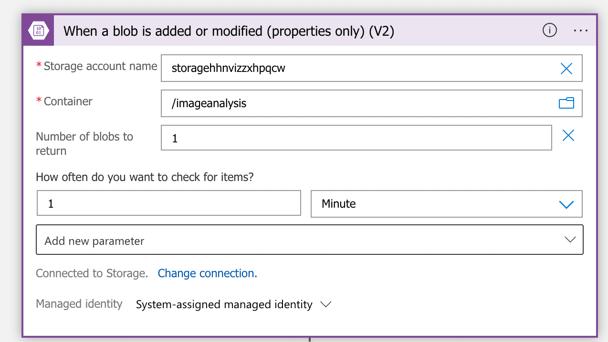
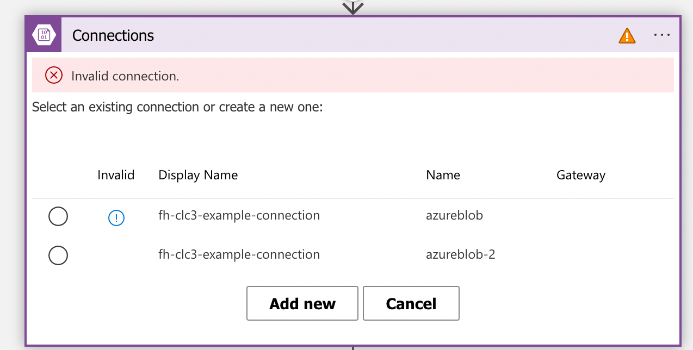
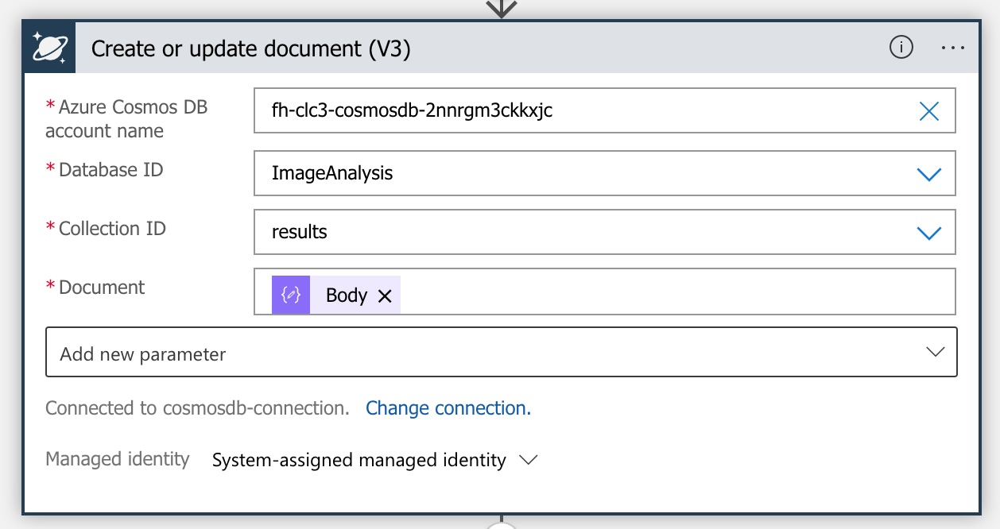

# Setup

## Requirements

* VS Code
* Docker
* Postman
* GitHub Account

## Environment Setup
1) fork the example respository. Link to GitHub documentation for forking a repo: https://docs.github.com/en/get-started/quickstart/fork-a-repo 
2) check out your own fork of the example repository
3) Open the folder in VS Code. You can either do this via File -> Open Folder.. or via command line by cd-ing into the folder and then using `code .` (Linux/Mac: if command `code` is not found, open VS Code, open the Command Palette and Execute `Shell Command: install 'code' command in PATH`)
4) make sure Docker is running
5) Use the Command Palette and execute `Remote-Containers: Open Folder in Container`. This should start a new Docker container in the background and open a new VS Code window with the project folder mounted. It will also ask to install a few recommended extensions. Depending on your hardware VS Code should finish loading shortly. Check the VS Code status bar at the very bottom to see if all activites were finished.
6) now you should have a complete dev environment running inside the docker container.

## Infrastructure Deployment
### Preparation:
Microsoft introduced the requirement to agree to their "Responsible AI" terms of service. Doing so requires the following steps:

1) Open portal.azure.com
2) Navigate into your subscription
3) In the left menu, click "Access control (IAM)"
4) Navigate to the "Role assignments" tab
5) Click "+ Add" in the top menu and click "Add role assignment" 
6) In the "Roles" tabs, select "Cognitive Services Contributor"
7) In the members tab click "+ Select members", and select your user in the newly openend menu on the right of the screen and click the "Select" button
8) Click the "Review + assign" button on the botton
9) Click the "Review + assign" button on the botton again
10) Now click the "Microsoft Azure" text in the topmost bar to navigate to the "Home" screen
11) Click "Create a resource"
12) Enter "Cognitive Services" in the search bar and press Enter
13) Click the blue "Create" button
14) Make sure your Student Subscription is selected if you already have several subscriptions
15) Click "Create new" below the "Resource group" dropdown. The list should be empty if you have not created any Azure resources so far
16) enter a name for your resource group (which name is not important since we will delte it right after creating the Cognitive Service account)
17) In the "Region" dropdown, select "West Europe"
18) Enter a name for the resource (again it does not matter which one since we will delete it again)
19) Unter Pricing Tier, select "Standard S0"
20) Check the box to acknowledge the Responsible AI terms
21) Click "Review + create" 
21) If validation is succesful, click "Create"
21) Wait until creation is done
21) Now click the "Microsoft Azure" text in the topmost bar to navigate to the "Home" screen again
22) Click on "Resourcxe groups" under "Navigate"
23) Select the resource group that was just created (see step 16)
24) Click "Delete resource group" in the menu bar
25) Make sure that the resource group only contains the custom vision service that we just created
26) Confirm by writing the name of the resource group into the text field and click the "Delete" button.


### Steps:
1) Open Terminal in the repo root folder
2) execute `cd ./infrastructure`
3) execute `az login --use-device-code` and log in to your Azure Free Trial account
You should see a similar output:
```
[
  {
    "cloudName": "AzureCloud",
    "homeTenantId": "f88d4b73-6bb2-4b9a-abc7-eb96e5a6407c",
    "id": "fb0e8e47-e203-45b3-a725-3a365ce122ba",
    "isDefault": true,
    "managedByTenants": [],
    "name": "Azure for Students",
    "state": "Enabled",
    "tenantId": "f88d4b73-6bb2-4b9a-abc7-eb96e5a6407c",
    "user": {
      "name": "p61219@fhooe.at",
      "type": "user"
    }
  }
]
```
4) execute `az account set --subscription <id from above output>`
5) execute `az deployment sub create --template-file main.bicep --location WestEurope`
   - The deployment will ask for the following values:
     - 'deploymentName': free choosable name for the deployment (e.g. `clc3-example`)
     - 'rgName': name of the resource group which should be created for the deployment(e.g. `rg-clc3-example-<lastname>`)
     
     **!!Important!!: use your last name as a prefix on the resource group name to avoid name colisions with other students**
     - 'location': region where the infrastructure should be created (e.g. `westeurope`)
6) **In case the deployment fails because it could not create the role-assignments, trigger the deployment a second time using the exact same values as before. This error is caused by Azure AD having a delay in the creation of new identities, while the template assumes that they are created immediately.**
---
## Function deployment
If the above deployment worked without errors you can deploy the function code as a next step.

1. Open the Azure portal (portal.azure.com) and navigate to the resource group created in the previous step.
2. Find the resource of type `Function App`in the list, click on the name and open the menu entry `Deployment Center`in the left-hand menu.

3. If there is already a GitHub connection, press "Disconnect" under Source
4. Set up a new connection to Github
   - Organization: should be same as your GitHub user
   - Repository: the forked repository from the infrastrcture setup
   - Branch: master
   - Build provider: GitHub Actions
   - Runtime stack: Java
   - Version: 11
5. Click `Save`. This will automatically add a new GitHub Actions workflow to your repository and trigger a build that should deploy your function. Chekc the status in the `Actions` tab in your GitHub repository.
6. Validate that the deployment worked. Find the resource of type `Function App`in the list, click on the name and open the menu entry `Functions` in the left-hand menu. You should see one entry with name `blobStorageUpload`, Trigger `HTTP` and Status `Enabled`

At this point, your function should be ready to upload an image to the blob storage. What's missing now is the configuration of the Logic App that get's triggered after a new file is added to the blob container and sends it to the Computer Vision service for analysis.

---
## Logic App Setup

### Prerequisites
Before continuing, find the following information in the Azure Cognitive Service instance that was created during the infrastructure deployment.
1. Click on your computer vision service in the resource group you created.
2. Click on `Keys and Endpoints` in the left-hand menu.
3. Copy the value in `Key 1` and `Endpoint` to a text file. You will need it in the next steps.

### Setup
1. Find the Logic App in your resource group named `fh-clc3-logicapp` and open it.
2. Click the `Edit` button in the top menu
3. Edit the steps marked with an orange exclamation mark. Those steps require a connection configuration to communicate the the underlying  Azure Services (Storage Account and Congitive Service).
   1. Edit the Trigger setep by clicking on it. You will see a list wiht one entry named "fh-clc3-example-connection" and a red error message "Invalid Connection"
   2. Select the invalid connection
   3. Under `Authentication Type` select `Logic App Managed Identity` and use name "fh-clc3-example-connection"
   4. The connection should look like this:
   
   

   5. Select the next step in the workflow. You will again see the connection tab, but now there should be a second connection with does not have an exclamation mark next to it. Select this entry.
    
   

   6. Select the next step in the worklfow. This is the connection to the Azure Computer Vision Service.

   

   7. Click the `Add new` button
   8. Enter the following values:
      * Connection name: `Computer Vision Connection`
      * Authentication Type: `Api Key` (already selected by default)
      * Account key: insert Key from the prerequisites step
      * Site URL: insert Endpoint URL from the prerequisites step
   9. Click `Create` 
   10. For the cosmosDB connection, you need to create a new connection as well. Choose a name and select the "Managed Identity" authentication type. The connection should look like this:

   

   11. Perform the same as in step 5 using the last step in the workflow.
   12. Click `Save` in the top menu bar of the Logic App. **Do not forget this, otherwise you have to re-do all steps**

---

## Testing
Get the URL of your function by
1. navigation to the Function App in the Azure portal
2. click `Functions` in the left hand menu
3. click on the name `blobStorageUpload` function
3. click `Get Function Url` and copy the complete URL displayed

To test your apllication, use the following curl command, either from the Terminal or use Postman:
````
curl --location --request POST '<Your Function URL>' \
--header 'Content-Type: application/octet-stream' \
--header 'Cache-Control: no-cache' \
--data-binary '@<Path to image file'
````

## Troubleshooting
* If you need to re-deploy the Bicep template, you need to purge the Cognitive Services manually. This can be done by navigating to the Cognitive Service in the Azure Portal (https://portal.azure.com/#view/Microsoft_Azure_ProjectOxford/CognitiveServicesHub/~/ComputerVision), select "Computer Vision" in the left-hand menu, then select "Manage deleted resources" in the top menu and then select and **Purge** all entries in the list on the right. Repeat this for the "Custom Vision" entry in the left-hand menu.
* If the GitHub action failes after starting with message "The template is not valid. .github/workflows/master_fh-clc3-<random>.yml (Line: 27, Col: 15): Unexpected value 'java-version: 11", you need to manually edit the file `.github/workflows/master_fh-clc3-<random>.yml` and replace the line `with: |+` with `with:` (remove the `|+`) and then re-trigger the action by pushing a new commit to your repository.

## Extra: Custom Vision
A more advanced version of this example uses the Custom Vision service in Azure to train a custom model.
As an example we want to distinguish soda bottles and let the model classify if it is either one of the following option:

* Coca Cola
* Fanta
* Sprite

1) First thing we need is to deploy the Custom Vision infrastructure. This was already done via the provided infrastructure template. It created a new training and prediction account inside the resource group.
To access the Custom Vision portal, open URL https://www.customvision.ai and log in with the same Microsoft user that you use for the Azure portal.

2) Next thing to do is to create a new project. The free tier allows to create 2 projects. Click on the "New Projects" button and enter the following:

   * Name: Soda identifier
   * Description: Vision model to detect Cola, Fanta and Sprite bottles in images
   * Resource: select "fhclc3excustvis*" (* is a random string generated during resource creation)
   * Project Type: Classifciation
   * Classification Types: Multiclass (single tag per image) 
   * Domains: Retail

3) Click "Create Project".

4) Now you are ready to upload the images.Go back to the Custom Vision portal (https://www.customvision.ai) and click "Add imgages". Perform the following steps:
   * navigate to the folder where you downloaded the training data set
   * open folder "fanta"
   * select all images and click "Open" to load them
   * a new window in the Custom Vision portal opens where you can add the tags
   * add tag "fanta" in the "My Tags" field and press enter
   * Click the "Upload x files" button (x depends on the number of images you selected)
   * repeat those steps for folder "coca_cola" and "sprite" and use tag values "coca cola" and "sprite"

5) If you uploaded and tagged all images, click the "train" button in the top right. You can choose between "Quick Training" and "Advanced Training". For better qualits, choose `Advanced Training` and set the maximum time to 1 hour (**ATTENTION: every additional hour will cost $10!**). Then click `Train`, get a snack and wait until it is finished.

6) When the training finisehd sucessfully you should see the results in the "Performance" tab. You should also see a `Publish`button on top. Click it to publish your model and choose a name.

7) Now we need the URL for our Azure function. Click `Prediction URL` and choose the second one where it says "If you have an image file". Remove the first part of the url **https://yourname.cognitiveservices.azure.com/** including the slash!
What is left should look like this: `customvision/v3.0/Prediction/63d58ba7-0a1c-4361-9bfb-2b29f749f7d1/classify/iterations/Version%201/image`

8) Store the URL path that is left in the Function App Configuration, using the name `CUSTOM_VISION_PREDICTION_PATH`

